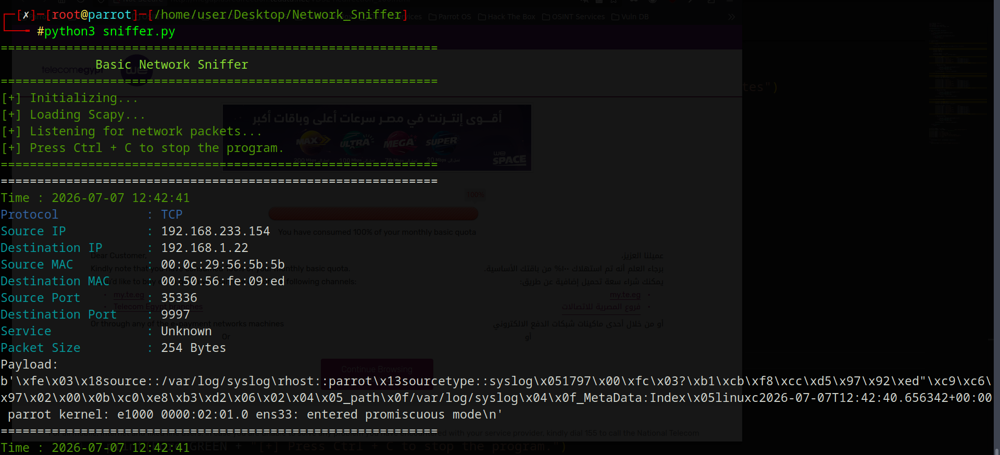
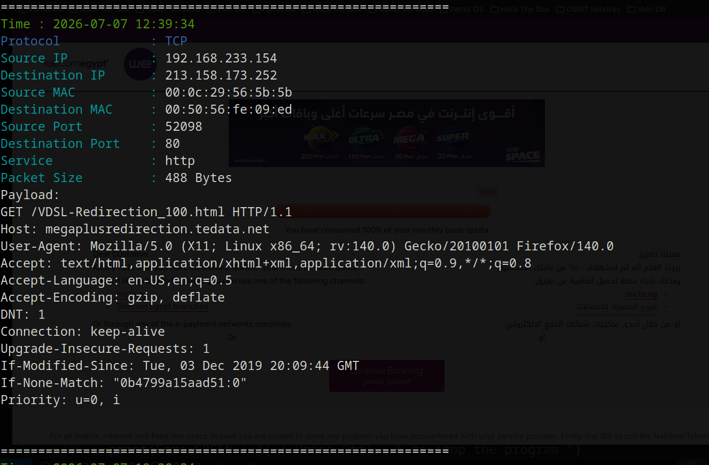
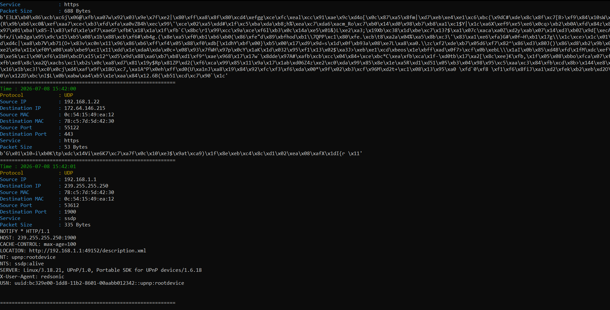

# Basic Network Sniffer



## Description

**Basic Network Sniffer** is a Python-based tool developed as part of my **CodeAlpha Cyber Security Internship**.

This project demonstrates the fundamentals of network packet capturing and analysis using the **Scapy** library. It captures live network traffic and displays useful packet information in a simple, organized, and colored terminal interface.

The main purpose of this project is to understand how network packets travel through the network and how different protocols can be analyzed using Python.

---

# Screenshots





---

# Features

- Capture live network packets.
- Detect TCP, UDP, and ICMP protocols.
- Display source and destination IP addresses.
- Display source and destination MAC addresses.
- Display source and destination ports.
- Identify common network services based on port numbers.
- Display packet size.
- Display packet payload (when available).
- Display the packet capture timestamp.
- Colored terminal output for better readability.
- Interactive network interface selection.
- Input validation for interface selection.

---

# Requirements

- Python 3.8 or later
- Scapy
- Colorama
- Administrator privileges (Windows)
- Root privileges (Linux)

---

# Installation

## Linux

```bash
git clone https://github.com/0xgbreil/CodeAlpha_BasicNetworkSniffer.git

cd CodeAlpha_BasicNetworkSniffer

pip3 install -r requirements.txt

sudo python3 sniffer.py
```

---

## Windows

```bash
git clone https://github.com/0xgbreil/CodeAlpha_BasicNetworkSniffer.git

cd CodeAlpha_BasicNetworkSniffer

pip install -r requirements.txt

python sniffer.py
```

### Important for Windows Users

Before running the project on Windows, install **Npcap**.

Download it from:

https://npcap.com/

During installation, make sure to enable the following option:

- **Install Npcap in WinPcap API-compatible Mode**

Finally, run the terminal or command prompt as **Administrator** before starting the program.

---

# Usage

1. Run the program.
2. The tool will display all available network interfaces.
3. Select the interface by entering its corresponding number.
4. The program will start capturing live network packets.
5. Press **Ctrl + C** at any time to stop packet capturing.

---


# Future Improvements

This project was intentionally kept simple to satisfy the internship requirements.

In the future, I plan to develop a more advanced version with additional features, including:

- Advanced packet filtering.
- Packet logging.
- Export captured packets.
- Protocol statistics.
- Enhanced packet analysis.
- Graphical User Interface (GUI).
- Support for additional network protocols.

---

# Contact

**Mohamed Gbreil (0xgbreil)**

- GitHub: https://github.com/0xgbreil
- LinkedIn: https://www.linkedin.com/in/0xgbreil/
- X (Twitter): https://x.com/0xgbreil

---

> **Note**
>
> This project was developed and tested on **Parrot OS Linux**.
> It is also compatible with **Windows** after installing **Npcap**.
